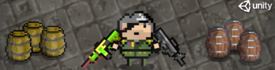

[![Contributors][contributors-shield]][contributors-url]
[![LinkedIn][linkedin-shield]][linkedin-url]

[![Status][badge]](https://github.com/RodrigoQuiroz09/Dungeon_Gunner) [![Udemy][udemy-shield]][udemy-url]

<!-- PROJECT LOGO -->
 

  

<h2 align="center">Dungeon Gunner Roguelike</h2>

<!-- TABLE OF CONTENTS -->

  
Table of Contents

  <ol>
    <li>
      <a href="#about-the-project">About The Project</a>
      <ul>
        <li><a href="#built-with">Built With</a></li>
        <li><a href="#external-tools">External Tools</a></li>
      </ul>
    </li>
    <li>
      <a href="#requirements">Requirements</a>
    </li>
    <li><a href="#acknowledgments">Acknowledgments</a></li>
  </ol>

<!-- ABOUT THE PROJECT -->

## About The Project

- Personal project only to show on portfolio made within the udemy course "Unity 2D Dungeon Gunner Roguelike Development Course" made by Rob Ager.
- Utilizing Unity's 2D Game Engine capabilities to craft a Rogue-like dungeon shooter in a 2D format/isometric, akin to titles such as 'Enter The Gungeon' and 'The Binding Of Isaac'.

(<a href="#top">back to top</a>)

### Built With

- [![Unity][unity.com]][unity-url]
- [![C#][csharp.com]][csharp-url]
- [![NET#][net.com]][net-url]

### External tools

- [![Unity][unity-a.com]][unity-a-url]
- [![Notion][notion.com]][notion-url]
- [![VSCode][vsc.com]][vsc-url]
  - <strong>Core Extensions</strong>
  - C# XML Documentation Comments
  - C# v1.24.4
  
(<a href="#top">back to top</a>)

<!-- GETTING STARTED -->

## Requirements

- Unity Version 2021.3.8f1 or Newer
- C# Programming Language
- Text Mesh Pro (Unity Library)

(<a href="#top">back to top</a>)

<!-- ACKNOWLEDGMENTS -->

## Acknowledgments and Assets

- All asset are access by the course material.

<!-- MARKDOWN LINKS & IMAGES -->
<!-- https://www.markdownguide.org/basic-syntax/#reference-style-links -->

[contributors-shield]: https://img.shields.io/github/contributors/RodrigoQuiroz09/Dungeon_Gunner.svg?style=for-the-badge
[contributors-url]: https://github.com/RodrigoQuiroz09/Dungeon_Gunner/graphs/contributors
[license-shield]: https://img.shields.io/github/license/RodrigoQuiroz09/Dungeon_Gunner.svg?style=for-the-badge
[license-url]: https://github.com/RodrigoQuiroz09/Dungeon_Gunner/blob/master/LICENSE.txt
[linkedin-shield]: https://img.shields.io/badge/-LinkedIn-black.svg?style=for-the-badge&logo=linkedin&colorB=555
[linkedin-url]: https://linkedin.com/in/rodrigo-q-3b8213129/
[badge-dev]: https://forthebadge.com/images/badges/built-by-developers.svg
[badge-dev-url]: http://ForTheBadge.com/images/badges/built-by-developers.svg
[product-screenshot]: images/mainmenu.PNG
[udemy-shield]: https://img.shields.io/badge//Made%20with-Udemy-EC5252?style=for-the-badge&logo=Udemy&logoColor=white
[udemy-url]: https://www.udemy.com
[unity-url]: https://unity.com
[unity.com]: https://img.shields.io/badge/Unity-100000?style=for-the-badge&logo=unity&logoColor=white
[unity-a-url]: https://assetstore.unity.com
[unity-a.com]: https://img.shields.io/badge/Unity-Asset-Store?style=for-the-badge&logo=unity&logoColor=white
[csharp-url]: https://docs.microsoft.com/en-us/dotnet/csharp/
[csharp.com]: https://img.shields.io/badge/C%23-239120?style=for-the-badge&logo=c-sharp&logoColor=white
[notion-url]: https://www.notion.so/product?fredir=1
[notion.com]: https://img.shields.io/badge/Notion-000000?style=for-the-badge&logo=notion&logoColor=white
[vsc-url]: https://code.visualstudio.com
[vsc.com]: https://img.shields.io/badge/Visual_Studio_Code-0078D4?style=for-the-badge&logo=visual%20studio%20code&logoColor=white
[net-url]: https://dotnet.microsoft.com/en-us/
[net.com]: https://img.shields.io/badge/.NET-5C2D91?style=for-the-badge&logo=.net&logoColor=white
[itchio-url]: https://itch.io
[itchio.com]: https://img.shields.io/badge/Itch.io-FA5C5C?style=for-the-badge&logo=itchdotio&logoColor=white
[badge]: https://img.shields.io/badge/Status-Done-green?style=for-the-badge
